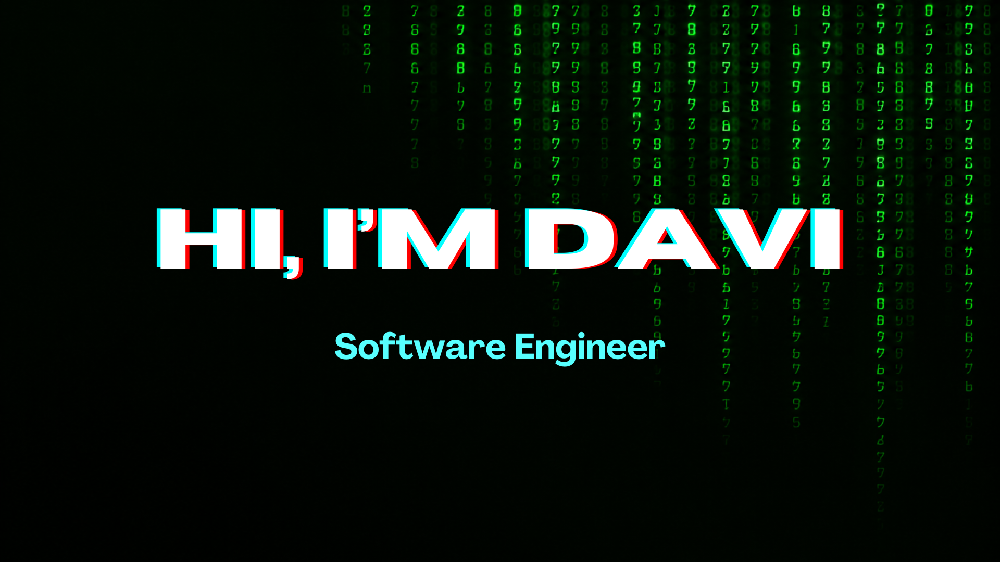

**Desenvolvedor Front-end** com experiência em desenvolvimento de aplicações web, integração com APIs e criação de soluções voltadas para as necessidades do negócio.

Atualmente, atuo como **Desenvolvedor Front-end na Blanes**, trabalhando principalmente com **JavaScript, TypeScript, React, HTML e CSS**.

Anteriormente, atuei como **Estagiário de Desenvolvimento de Sistemas no Bradesco**, onde trabalhei com **PHP, SQL Server, consultas SQL e automação de processos**.

### 🛠️ Tecnologias & Ferramentas

* **Front-end:** JavaScript, TypeScript, React, HTML, CSS
* **Back-end:** PHP, Node.js, Python
* **Banco de dados:** SQL Server, MySQL, SQL
* **Ferramentas:** Git, GitHub, Docker, Figma
* **Outros:** APIs REST, IA Generativa, Cloud

### 📫 Contato

* **LinkedIn:** [seu LinkedIn]
* **E-mail:** [seu e-mail]
* **GitHub:** [seu GitHub]

<!--
**DaviiDias/DaviiDias** is a ✨ _special_ ✨ repository because its `README.md` (this file) appears on your GitHub profile.

Here are some ideas to get you started:

- 🔭 I’m currently working on ...
- 🌱 I’m currently learning ...
- 👯 I’m looking to collaborate on ...
- 🤔 I’m looking for help with ...
- 💬 Ask me about ...
- 📫 How to reach me: ...
- 😄 Pronouns: ...
- ⚡ Fun fact: ...
-->
